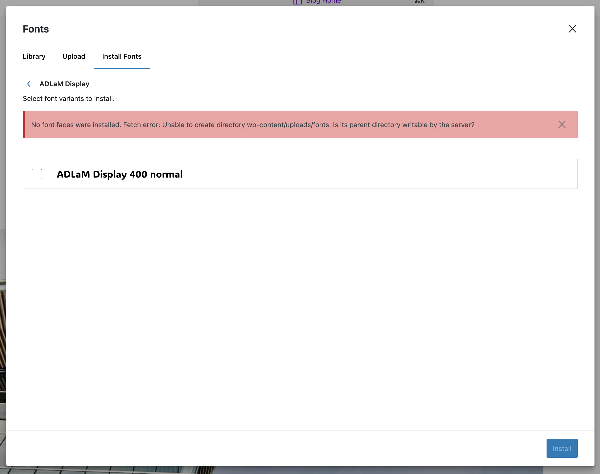

This section provides information on how to use the WordPress Font Library on Pantheon.

[WordPress 6.5 (release name)]() introduced a new [Font Library]() feature. The Font Library allows you to upload fonts to your WordPress site or install any of the fonts available from Google's font library. In anticipation of this, Pantheon has added a feature to our [Pantheon MU Plugin](https://github.com/pantheon-systems/pantheon-mu-plugin) to store those fonts in a writeable (`wp-content/uploads/fonts/`) directory, so that you can use the feature without any issues after updating your sites to 6.5. This changes the default WordPress core behavior of storing fonts in `wp-content/fonts/` to work on Pantheon.

## Using the `font_dir` Filter

You can change the directory where fonts are stored by using the WordPress core filter `font_dir` like this:

```php
add_filter( 'font_dir', function( $defaults ) {
	$font_dir = '/path/to/your/custom/dir';
	$font_url = site_url( $font_dir );
	
	$defaults['path'] = $font_dir;
	$defaults['url'] = $font_url;
	$defaults['basedir'] = $font_dir;
	$defaults['baseurl'] = $font_url;
	
	return $defaults;
} );
```

The default priority for WordPress filters is `10`. We have set _our_ `font_dir` filter to priority `9` so it allows you to override our modification.

<Alert title="Note" type="info">

You cannot use the function `wp_get_upload_dir()` inside the `font_dir` filter because it will cause an infinite loop. Instead, if you want to use the `wp_get_upload_dir()` function, you can use a global variable as [we do in our mu-plugin](https://github.com/pantheon-systems/pantheon-mu-plugin/blob/main/inc/fonts.php) or [remove the filter and then re-add it](https://github.com/WordPress/wordcamp.org/pull/1245/files#diff-e441f1053cefcd468bd20fed91d1aac5e902871d7c564be909fc35590f9c3082R635-R637).

For more information, refer to [this Gutenberg issue](https://github.com/WordPress/gutenberg/issues/58696).

</Alert>

## Considerations

WordPress handles fonts more like **media files** than **plugins or themes**. This means that when fonts are added to one Pantheon site environment, they will not necessarily exist in your other WordPress environments (e.g. installing a font on Dev does not mean it will push to Test when you deploy). In WordPress, fonts have two parts, there is an underlying font post type (similar to the `attachment` post type for media files) and the physical font files themselves. Without the font post type existing in the database, WordPress has no way of knowing that a font is installed (in the same way that WordPress has no way that a particular image exists in the `/uploads` directory if it was not uploaded via the media library).

If you intend to override the Pantheon behavior, care should be taken that you are not doing so with the assumption that committing font files to your repository will make them available automatically on your other environments.

## Troubleshooting

### "No font faces were installed" error message



If you have disabled our modification or are uploading to a directory that is not writeable, you may see this error message. Ensure that if you are overriding our `font_dir` filter, that the directory you are using instead is writeable (e.g. in `wp-content/uploads/`).

### I've cloned my database from Live and my font is installed but not "active"


If you've cloned your database and files from your live environment to Dev or Test and the font appears in your Font Library but is not "active" (it displays a message like "0/1 variants active"), you can click into the font, select the variant you want, and click update. 


### I've uploaded fonts to my `/fonts` directory, but they aren't showing up in the Font Library

Fonts need to be installed via the Font Library in the WordPress admin. This is because, in the backend, they are stored as a post type. Therefore, simply having a font in your `/fonts` directory does not necessarily mean it will be recognized by WordPress.

## More Resources
* [Font Library Gutenberg Tracking Ticket](https://github.com/WordPress/gutenberg/issues/55277)