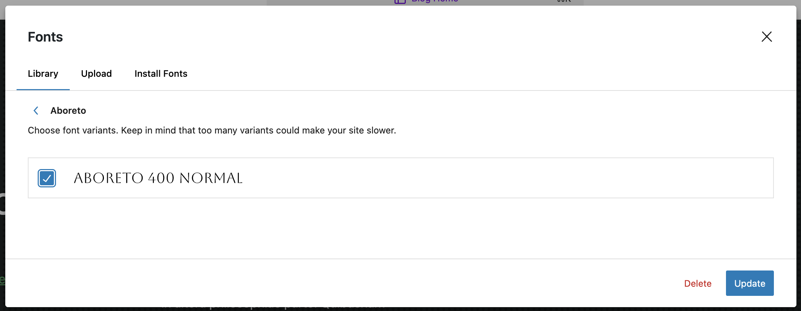

This section provides information on how to use the WordPress Font Library on Pantheon.

[WordPress 6.5 (release name)]() introduced a new [Font Library]() feature. The Font Library allows you to upload fonts to your WordPress site or install any of the fonts available from Google's font library. In anticipation of this, Pantheon has added a feature to our [Pantheon MU Plugin](https://github.com/pantheon-systems/pantheon-mu-plugin) to store those fonts in a writeable (`wp-content/uploads/fonts/`) directory, so that you can use the feature without any issues after updating your sites to 6.5. This changes the default WordPress core behavior of storing fonts in `wp-content/fonts/` which requires committing fonts to your Pantheon site repository and deploying them from Dev to Test to Live.

## Using the Filter

If you want to use the default WordPress behavior and store fonts in `wp-content/fonts` or customize the location of your installed fonts, you can use the following filter:

```php
add_filter( 'pantheon_modify_fonts_dir', '__return_false' );
```

Put this code somewhere in your site codebase as a plugin, in a theme `functions.php` file or in a [custom mu-plugin](https://docs.pantheon.io/guides/wordpress-configurations/wordpress-custom-code). This will restore the original behavior and commit fonts to your site repository.

You can _change the directory_ where fonts are stored by using the WordPress core filter `font_dir` like this:

```php
add_filter( 'font_dir', function( $defaults ) {
	$font_dir = '/path/to/your/custom/dir';
	$font_url = site_url( $font_dir );
	
	$defaults['path'] = $font_dir;
	$defaults['url'] = $font_url;
	$defaults['basedir'] = $font_dir;
	$defaults['baseurl'] = $font_url;
	
	return $defaults;
} );
```

<Alert title="Note" type="info">

You cannot use the function `wp_get_upload_dir()` inside the `font_dir` filter because it will cause an infinite loop. Instead, if you want to use the `wp_get_upload_dir()` function, you can use a global variable as [we do in our mu-plugin](https://github.com/pantheon-systems/pantheon-mu-plugin/blob/main/inc/fonts.php) or [remove the filter and then re-add it](https://github.com/WordPress/wordcamp.org/pull/1245/files#diff-e441f1053cefcd468bd20fed91d1aac5e902871d7c564be909fc35590f9c3082R635-R637).

For more information, refer to [this Gutenberg issue](https://github.com/WordPress/gutenberg/issues/58696).

</Alert>

## Considerations

The distinction between the two approaches for handling fonts depends what works best for your workflow and whether you consider your fonts to be handled more like media files or more like themes and plugins.

**If you consider fonts to be more like media files**, use the default Pantheon behavior added in our `mu-plugin`. This makes it easier to _install fonts onto production sites_ but requires you to pull your database and files to the lower environments from Live. See [our documentation about database workflows](https://docs.pantheon.io/guides/mariadb-mysql/database-workflow-tools) for more information.

**If you consider fonts to be more like themes and plugins**, use the WordPress default behavior and the `pantheon_modify_fonts_dir` filter. This ensures that the fonts are installed across environments, but does not necessarily mean that fonts that are _physically installed_ on your lower environments (e.g. they exist in the `wp-content/fonts` directory) are recognized by WordPress. (They may still need to be added in the WordPress admin.)

## Troubleshooting

### "No font faces were installed" error message


If you have disabled our modification and are using WordPress's default handling (uploading to `wp-content/fonts/`), there are two reasons you might receive an error message reporting that no fonts were installed and asks if the parent directory is writable by the server.

1. The site environment is Dev and is in Git mode. If the Dev environment is set to Git mode, the filesystem is not writeable and you will not be able to install fonts.
2. The site environment is Test or Live and you've set the `'pantheon_modify_fonts_dir'` filter value to `false`. In this case, you will not be able to install fonts on any environment other than Dev and you will need to commit them to your codebase.

### I've cloned my database from Live and my font is installed but not "active"


If you've cloned your database and files from your live environment to Dev or Test and the font appears in your Font Library but is not "active" (it displays a message like "0/1 variants active"), you can click into the font, select the variant you want, and click update. 



### I've uploaded fonts to my `/fonts` directory, but they aren't showing up in the Font Library

Fonts need to be installed via the Font Library in the WordPress admin. This is because, in the backend, they are stored as a post type. Therefore, simply having a font in your `/fonts` directory does not necessarily mean it will be recognized by WordPress.

## More Resources
* [Font Library Gutenberg Tracking Ticket](https://github.com/WordPress/gutenberg/issues/55277)